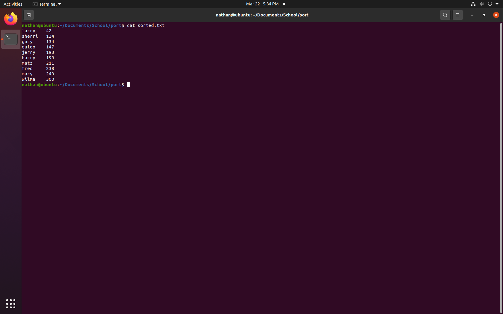

Portfolio
=========

Programming Projects
--------------------

*For access to my private project repositories, please [email me](mailto:NDSatterfield@csustudent.net?subject=GitHub%20Access) with the subject line, GitHub Access.

---
### [File Transfer Client | CSCI 332](project1)

---
### [Score Sort | CSCI 301](project2)

---
### [String Conversion | CSCI 325](project3)

---
### [Project 4 Title | CSCI 332](project1)

---

Ethics Papers
-------------

### [Human Factors In Cyber Security](/pdf/Human-Factor.pdf)

-   **CSCI 405:**  
-   **95:**

### [Intellectual Property](/pdf/Intellectual-Property.pdf)

-   **CSCI 332:** 
-   **100:**

### [What is copyright and how does it apply to computer programming](/pdf/copyright.pdf)

-   **CSCI 301:** 
-   **95:**

---

Presentations
-------------

### [Home Depot security breach](/pdf/Home-Depot.pdf)

- **CSCI 405:** 
- **95:**

### [Nord VPN breach](/pdf/Nord.pdf)

- **CSCI 301:** 
- **97:**

---

Page template forked from <a href="https://github.com/csu-cs/csci-portfolio">CSU-CS</a>

<!-- Remove above link if you don't want to attributive -->
