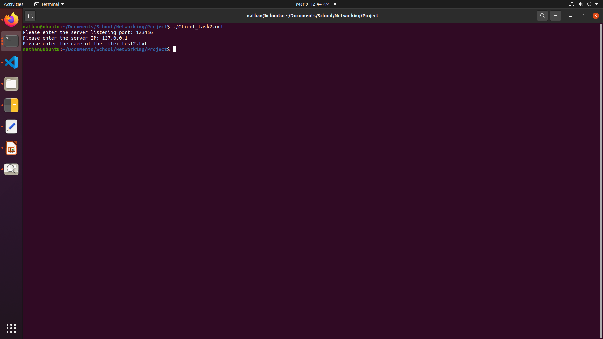

[Back to Portfolio](./)

File Transfer Client
===============

-   **CSCI 332:** 
-   **100:**
-   **C++:**
-   **Source Code Repository:** [File Transfer Client](https://github.com/Nathan-Satt/FileTransfer/)  
    (Please [email me](mailto:NDSatterfield@csustudent.net?subject=GitHub%20Access) to request access.)

## Project description

This program allows a user to send a text file over the network to a remote server running the accompaning server side code. The program asks the user for a port number IP address and file name and it then begins to send the file. It does this by finding the length of the file which it then sends to the server so the server will know when the transfer is complete. It then begins reading in the file 999 bits at a time and then sending that chunk as a single packet this is done untill there is no more data left to send.

## How to compiles / run the program

How to compile (if applicable) and run the project.

```bash
g++ Client_task2.cpp -g -lpthread -lrt -o Client_task2.out
./Client_task2.out
```

## UI Design

When the program is run it first asks the user for the port number that the server is listening on, it then asks for the IP address for the server, and lastly it asks the user for the name of the file to be sent (see Fig 1). On the server side when the program is started it asks for a port number to set the listening port (see Fig 2). Once a client contacts the server the server will print out the size of the file being sent to the console and then as packets start arriving the server prints outthe packent number and amount of data recived in each packet until the transfer is complete and the program exits (see Fig 2).  


Fig 1. Client input prompts 


Fig 2. Server Side output

## 3. Additional Considerations

For the file transfer client to work there must be an accompanying server to transfer the file to. The client and server must also be able to communicate over the network on the given port so in some cases firewall rules may be necessary for the client to be able reach the server.

For more details see [GitHub Flavored Markdown](https://guides.github.com/features/mastering-markdown/).

[Back to Portfolio](./)
