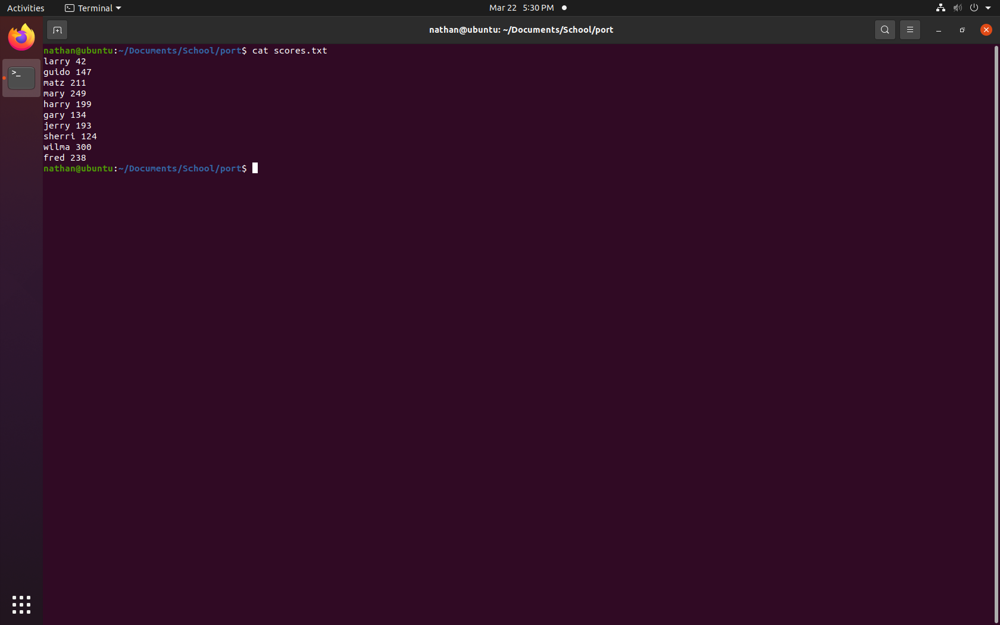
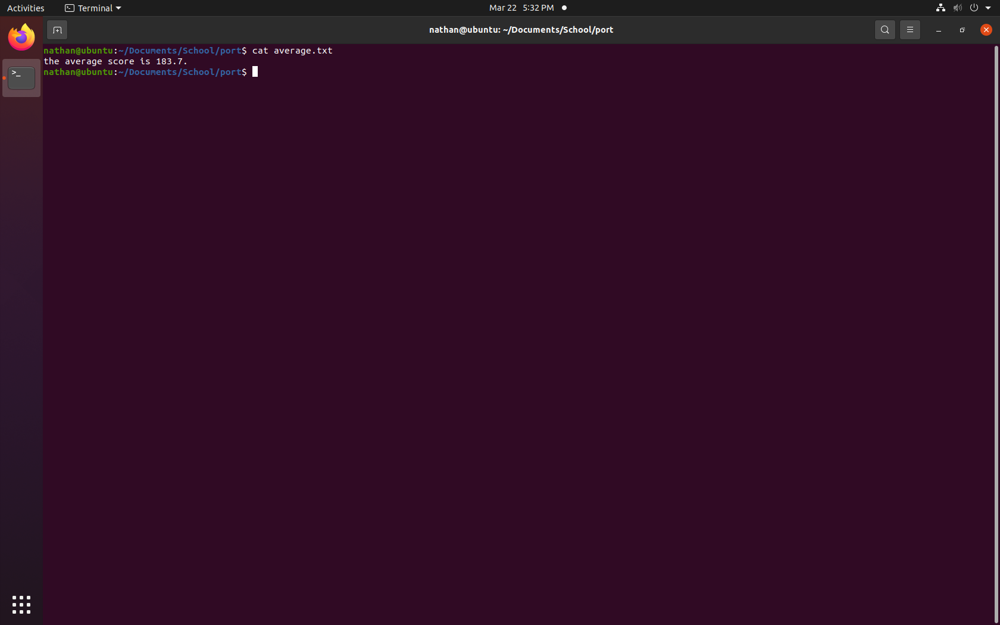
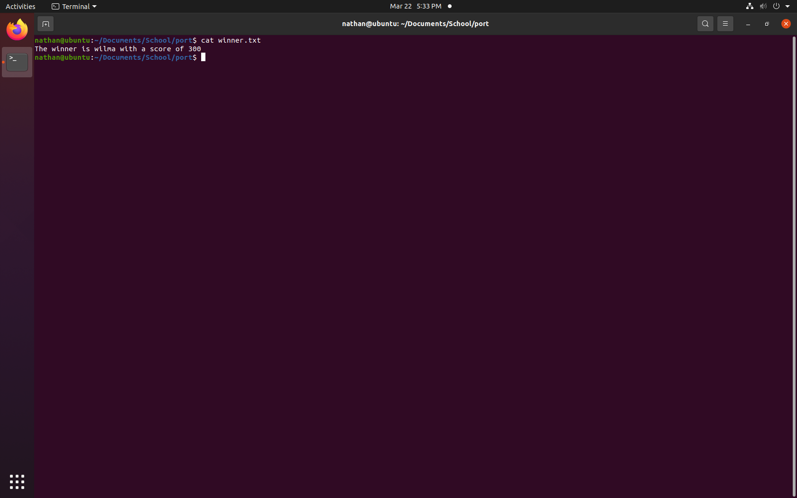

[Back to Portfolio](./)

Score Sort
===============

-   **CSCI 301:** 
-   **100:**
-   **Perl:**
-   **Source Code Repository:** [Score Sort](https://github.com/Nathan-Satt/ScoreSort/)  
    (Please [email me](mailto:NDSatterfield@csustudent.net?subject=GitHub%20Access) to request access.)

## Project description

This program reads in a lists of names and scores from the text file scores.txt which it then stores as a hash. It then adds all the scores together and divides by the total number of scores to get the average which it then writes to the file average.txt. It then sorts the hash based on score with the lowest score at the top and highest at the bottom and writes the names and scores to sorted.txt and stores the name of the person with the highest score. It then writes the winners name and score to winner.txt 

## How to compiles / run the program

How to compile (if applicable) and run the project.

```bash
./ScoreSort
```

## UI Design

This programs takes a list of names and socres seperated by a space with one entry per line stored in scores.txt (see Fig 1). It then uses that imput to calculte the average score (see Fig 2). It also sorts the scores and writes the sorted values to a file (see Fig 3). Lastly it takes the highest scoring person and writes their name and score to a file (see Fig 4).


Fig 1. Unsorted list of scores 


Fig 2. Average score


Fig 3. Sorted list of scores


Fig 4. Name of the winner and their score 
## 3. Additional Considerations

For this progran to work the list of names must be stored in a file called scores.txt and the format must be a name followed by a space and then the score. 

For more details see [GitHub Flavored Markdown](https://guides.github.com/features/mastering-markdown/).

[Back to Portfolio](./)
