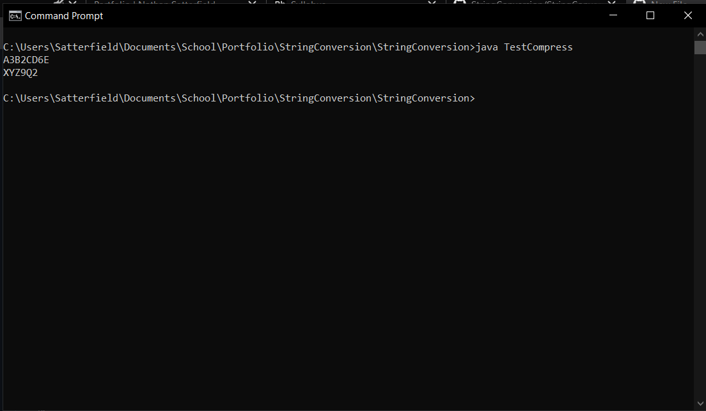

[Back to Portfolio](./)

String Conversion
===============

-   **CSCI 325:** 
-   **92:**
-   **Java:**
-   **Source Code Repository:** [String Conversion](https://github.com/Nathan-Satt/StringConversion/)  
    (Please [email me](mailto:NDSatterfield@csustudent.net?subject=GitHub%20Access) to request access.)

## Project description

This program provides several functions for formating and testing with strings. The first operation it does is compress strings by removing repeated letters and adding a counter if the letter appears more than once. It also has functions to convert equations from postfix to infix format and from prefix to infix format. There is also a function to check if a string is an arithmetic operator which is used to when converting from postfix to infix or prefix to infix. The last function this program can preform is checking if a given string is a palindrome.

## How to compiles / run the program

How to compile (if applicable) and run the project.

```bash
javac ./csci325/*.java
javac *.java
java TestCompress
java TestInfix
java TestPal
java TestIsOperator
```

## UI Design

When a string is compressed the program will return the compressed string which can then be printed to the console (see Fig 1). The program doess the same when converting from either prefix or postfix to infix where the new string is returned and can then be printed (see Fig 2). When converting from postfix or prefix to infix sometimes the given equation is not correcly formated which will causes an excption which is then caught an the function then returns an error message (see Fig 2). The last two functions test if a string is a palindrome and if a string is an arithmetic operator these functions will return true if the string is or false if it is not (see Fig 3 & 4).


Fig 1. Output of TestCompress 


Fig 2. Output of TestInfix 


Fig 3. Output of TestPal


Fig 4. Output of TestIsOperator

## 3. Additional Considerations

The program does not print any of the values out itself the values are returned as strings or booleans which can then be printed otherwise the program will not have any output.

[Back to Portfolio](./)
