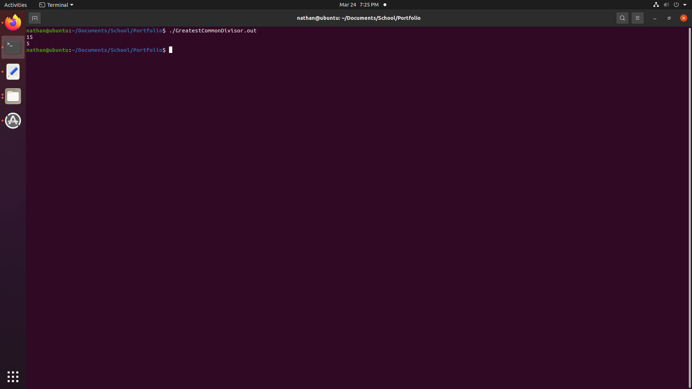

[Back to Portfolio](./)

Greatest Common Divisor
===============

-   **CSCI 330:** 
-   **100:**
-   **NASM Assembly:**
-   **Source Code Repository:** [Greatest Common Divisor](https://github.com/Nathan-Satt/GreatestCommonDivisor/)  
    (Please [email me](mailto:NDSatterfield@csustudent.net?subject=GitHub%20Access) to request access.)

## Project description

This program takes two numbers and finds the greatest common divisor or gcd which is the largest integer that will divide two given numbers. It does this using recursive divison starting with the two numbers and then recusivly devides the previous divisor by the remainder until the current divisor is equal to zero. Then program then ends the recursion and prints the result.

## How to compiles / run the program

How to compile (if applicable) and run the project.

```bash
nasm -felf64 lab10.asm && gcc -no-pie -fPIC lab10.o -o GreatestCommonDivisor.out
./GreatestCommonDivisor.out
```

## UI Design

The program takes two numbers and prints out the the result of the greatest common divisor calculation (see Fig 1).


Fig 1. Greatest common divisor of 120 and 15 as well as 125 and 15

## 3. Additional Considerations

This program will only run on 64-bit processors and will not run on older 32-bit processors. 

[Back to Portfolio](./)
